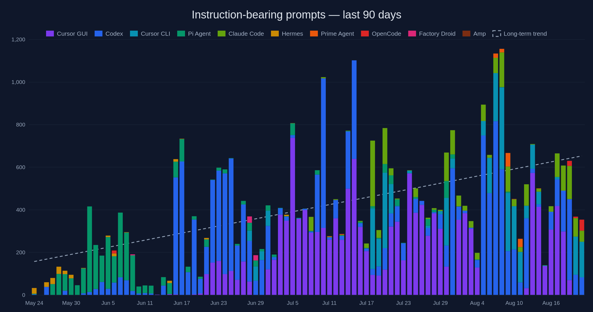

# Agentic Productivity

I wanted to see whether spending time on different tools, setups and internal software is actually improving my productivity. So I built this tool that measures the number of agent sessions, user prompts and git commits I make over time. That way I have real data telling me whether I'm getting more productive or just wasting time building bullshit internal tooling that's not driving results.



## Setup

Clone this repo and run the installer:

```sh
./scripts/install.sh
```

It walks you through everything: installs the app and LaunchAgent, asks for your Discord webhook (stored in macOS Keychain, hidden input), and finishes by sending a test report to your channel so you see the charts right away.

The LaunchAgent then checks for agent sessions every five minutes and sends yesterday's report at 08:00 in your local timezone. It catches up after wake.

Every morning it sends those charts to a private Discord channel:

- unique local Git commits
- active agent sessions, split by harness
- instruction-bearing prompts, split by harness

Your prompts, paths, and identities never leave your Mac — only daily counts go to quickchart.io to render the charts.

90-day window, trendline on every chart.

## Requirements

- Apple Silicon Mac
- Python 3.11 or newer
- Git
- internet access to QuickChart and Discord during report delivery

No third-party Python dependencies.

## Commands

```sh
./bin/agentic-productivity doctor     # check health
./bin/agentic-productivity collect    # collect metrics
./bin/agentic-productivity mock       # render the report without sending
./bin/agentic-productivity status     # show collector state
./scripts/install.sh                  # install app + LaunchAgent
./scripts/uninstall.sh                # remove both
```

Use `collect --days N` to backfill any window from 1 to 366 days. The scheduled Discord report uses 90 days.

## Documentation

- [Architecture](docs/architecture.md)
- [Metric definitions](docs/metrics.md)
- [Collector registry](docs/collectors.md)
- [launchd operation](docs/launchd.md)
- [Decision records](docs/adr/README.md)

## License

[MIT](LICENSE)
